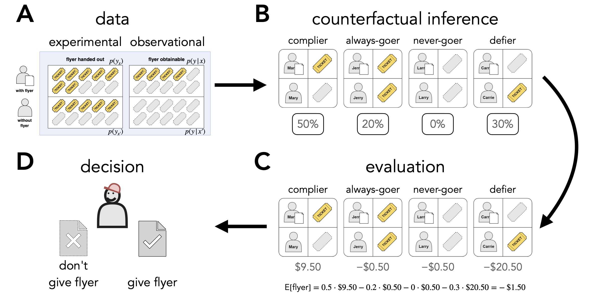

# Making good decisions

## Abstract 

Making a good decision often requires knowing something counterfactual: whether a person would be better off if we acted than if we didn't. Formal work shows how both experimental and observational data ought to be combined to inform good decisions. Here, we ask whether people's intuitions track this normative standard. In three experiments ($N = 354$), participants decided whether or not to act based on observational and experimental data. Participants performed better than chance but far from optimally. Trial-by-trial feedback about the consequences of their choices, including what would have happened had they chosen otherwise, didn't improve performance. The breakdown was specifically at the inference step: participants' estimates of the different counterfactual types were almost unrelated to the normative estimates, yet their decisions followed coherently from those (incorrect) estimates. Experts in statistics, economics, and data science made better decisions than novices, but their counterfactual inferences were no more accurate. Counterfactual reasoning is critical for making good decisions from experimental and observational data, but its logic doesn't come naturally to people.




## Repository structure 

```
.
├── code
│   ├── experiments
│   ├── julia
│   └── R
├── data
│   ├── experiment1_feedback
│   ├── experiment1_no_feedback
│   ├── experiment2_data_composition
│   ├── experiment2_people_inference_novice
│   └── experiment3_people_inference_expert
├── docs
│   ├── analysis
│   ├── calculator
│   ├── experiment1
│   ├── experiment2
│   └── experiment3
└── figures
    ├── diagrams
    ├── plots
    └── trials
```

## Pre-registrations 

- Experiment 1: [no feedback condition](https://osf.io/jcwug); [feedback condition](https://osf.io/a4uwb) 
- Experiment 2: [people inference condition](https://osf.io/8nyfu); [data composition condition](https://osf.io/npgzb)
- Experiment 3: [people inference experts](https://osf.io/bysmk/)

## Experiment demos 

The experiment demos all show versions for which the experimental data is on the left side, and the observational data is on the right side. In the actual experiments, the order was counterbalanced. 

- Experiment 1: [no feedback condition](https://cicl-stanford.github.io/good_decisions/experiment1/no_feedback); [feedback condition](https://cicl-stanford.github.io/good_decisions/experiment1/feedback) 
- Experiment 2: [people inference condition](https://cicl-stanford.github.io/good_decisions/experiment2/people_inference); [data composition condition](https://cicl-stanford.github.io/good_decisions/experiment2/data_composition)
- Experiment 3: [people inference experts](https://cicl-stanford.github.io/good_decisions/experiment3)

## Interface 

This [interactive interface](https://cicl-stanford.github.io/good_decisions/calculator) allows you to enter different data sets to explore what the expected benefit of handing out the flyer would be. 

### code 

#### experiments 

Code for all the online experiments.

#### julia 

Code that implements the counterfactual decision model. 

#### R

Code for statistical analyses, data visualizations, and tables. 

You can view the analysis file in your browser [here](https://cicl-stanford.github.io/good_decisions/analysis/good_decisions_analysis.html).

### data 

Data for all experiments. 

### docs 

The docs folder contains the statistical analysis, an interactive interface to explore different datasets and benefit parameters, and a demo of each experiment.

### figures 

#### plots 

Paper figures. 

#### diagrams 

Diagrams from the paper. 

#### trials 

Trial images. 

## CRediT author statement 

For definitions of the different terms see [here](https://www.elsevier.com/authors/policies-and-guidelines/credit-author-statement). 

| Term                       | Ricky | Scott | Thomas | Tobias |
|----------------------------|-------|-------|--------|--------|
| Conceptualization          | x     | x     | x      | x      |
| Methodology                | x     | x     | x      | x      |
| Software                   | x     |       |        | x      |
| Validation                 | x     | x     |        | x      |
| Formal analysis            | x     | x     |        | x      |
| Investigation              | x     |       |        | x      |
| Resources                  |       |       |        | x      |
| Data Curation              | x     |       |        | x      |
| Writing - Original Draft   |       |       |        | x      |
| Writing - Review & Editing | x     | x     | x      | x      |
| Visualization              | x     |       |        | x      |
| Supervision                |       |       |        | x      |
| Project administration     |       |       |        | x      |
| Funding acquisition        |       |       |        | x      |